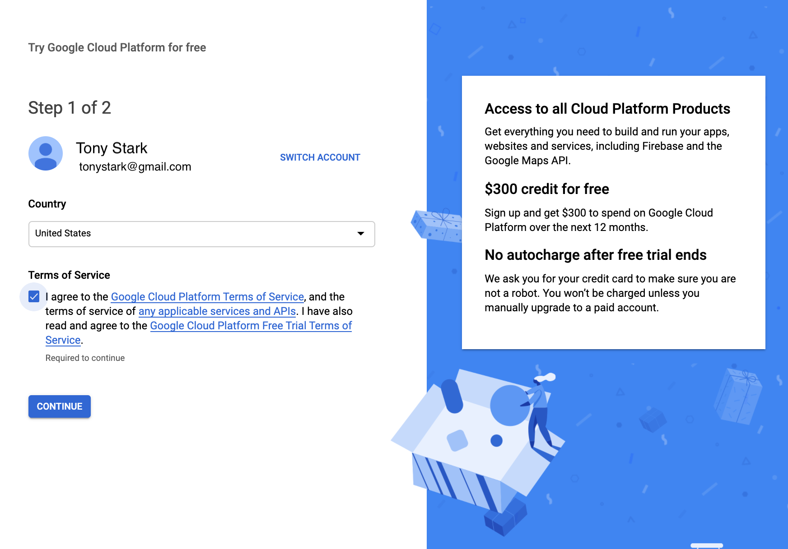
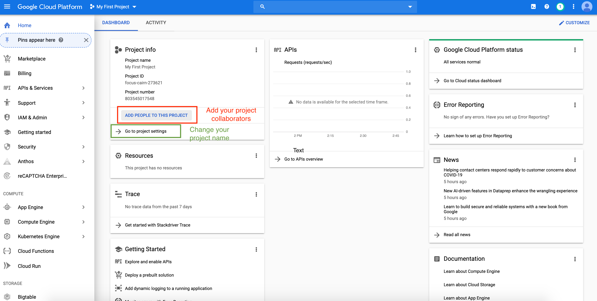
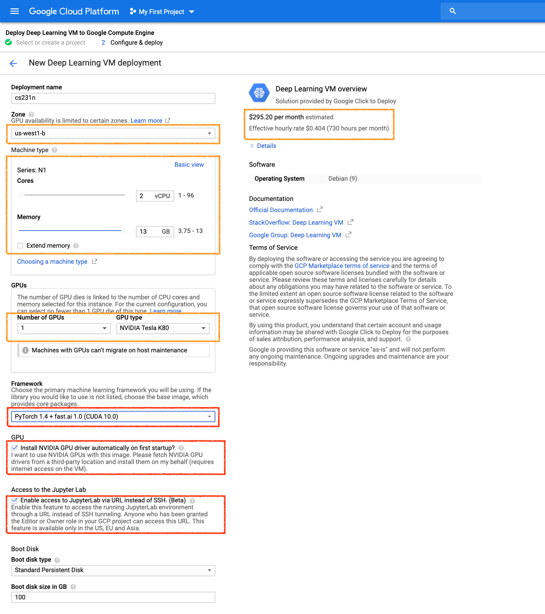
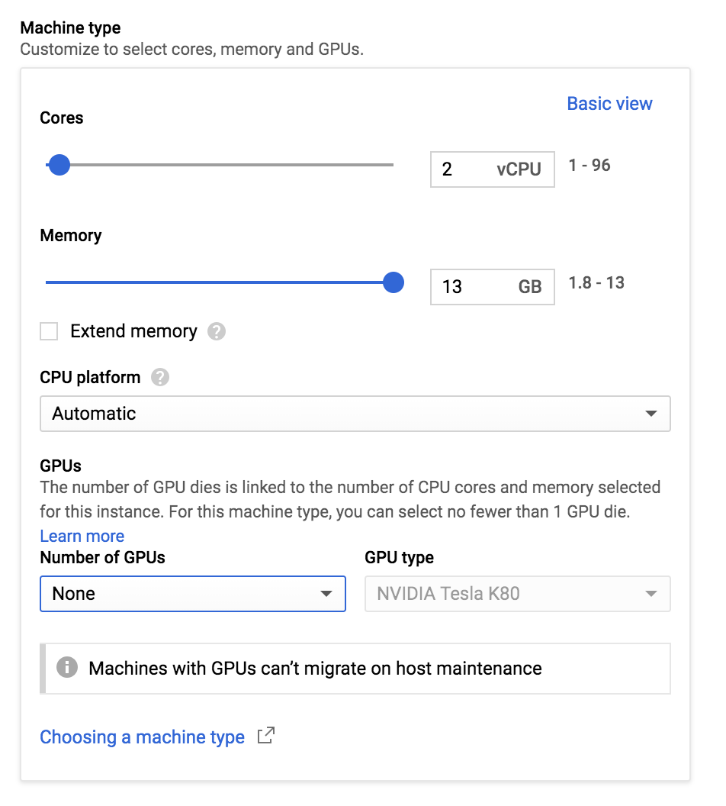
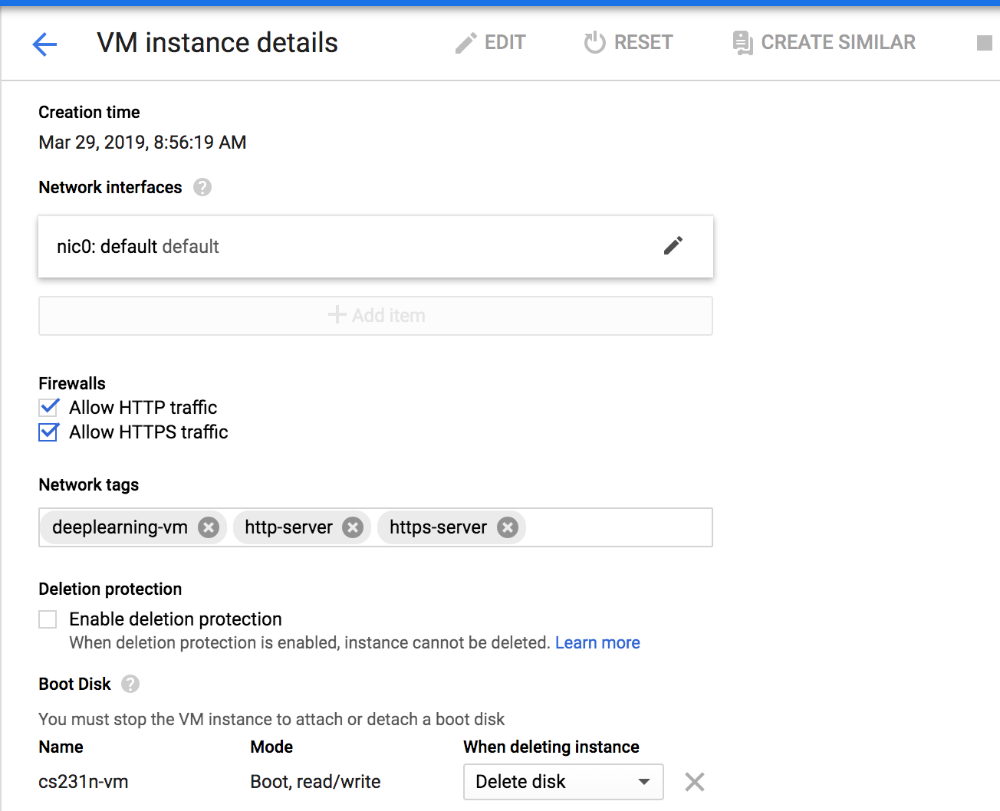
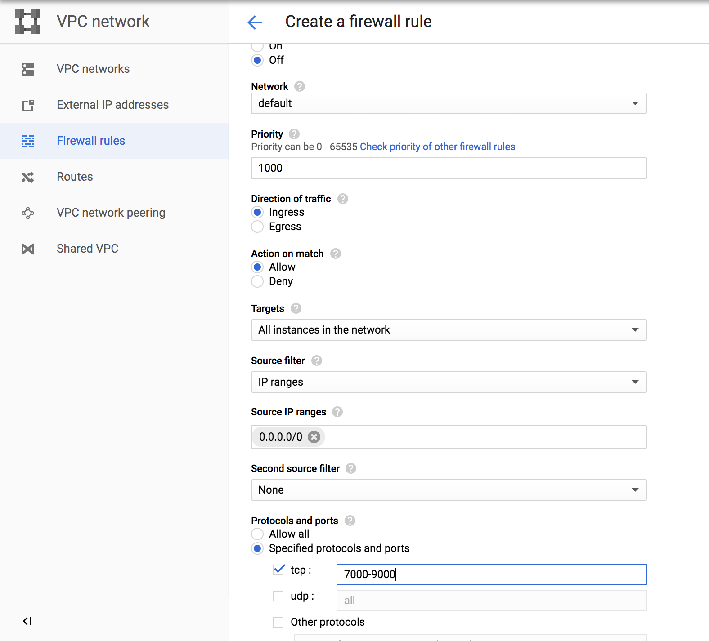
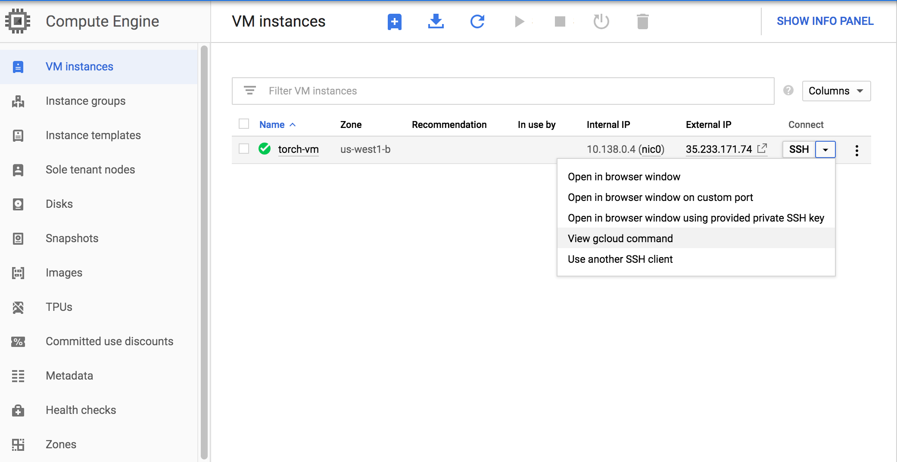

# Google Cloud Setup and Tutorial


## BEFORE WE BEGIN ##
### BIG REMINDER: Make sure you stop your instances! ###

(We know you won't read until the very bottom once your assignment is running, so we are printing this at the top too since it is ***super important***)

Don't forget to ***stop your instance*** when you are done (by clicking on the stop button at the top of the page showing your instances), otherwise you will ***run out of credits*** and that will be very sad. :(

If you follow our instructions below correctly, you should be able to restart your instance and the downloaded software will still be available.

## Create and Configure Your Account ##

For the class project and assignments, we offer an option to use Google Compute Engine for developing and testing your
implementations. This tutorial lists the necessary steps of working on the assignments using Google Cloud. **We expect this tutorial to take about an hour. Don't get intimidated by the steps, we tried to make the tutorial detailed so that you are less likely to get stuck on a particular step. Please tag all questions related to Google Cloud with google_cloud on Piazza.**

This tutorial goes through how to set up your own Google Compute Engine (GCE) instance to work on the assignments. Each student will have $100 in credit throughout the quarter. When you sign up for the first time, you also receive $300 credits from Google by default. Please try to use the resources judiciously. But if $100 ends up not being enough, we will try to adjust this number as the quarter goes on.

First, if you don't have a Google Cloud account already, create one by going to the [Google Cloud homepage](https://cloud.google.com/?utm_source=google&utm_medium=cpc&utm_campaign=2015-q2-cloud-na-gcp-skws-freetrial-en&gclid=CP2e4PPpiNMCFU9bfgodGHsA1A "Title") and clicking on **Compute**. When you get to the next page, click on the blue **TRY IT FREE** button. If you are not logged into gmail, you will see a page that looks like the one below. Sign into your gmail account or create a new one if you do not already have an account.



Click the appropriate **yes** or **no** button for the first option, and check **yes** for the second option after you have read the required agreements. Press the blue **Agree and continue** button to continue to the next page to enter the requested information (your name, billing address and credit card information). Remember to select "**Individual**" as "Account Type":


Once you have entered the required information, press the blue **Start my free trial** button. You will be greeted by a page like this:


Click the "Google Cloud Platform" (in red circle), and it will take you to the main dashboard:



To change the name of your project, click on [**Go to project settings**](console.cloud.google.com/iam-admin/settings/project) under the **Project info** section.

## Request an increase in GPU quota

Your account typically does not come with GPU quota. You have to explicitly request for it under **IAM Admin** > **Quotas**. Follow the instructions at:

* [General quota instructions](https://cloud.google.com/compute/quotas#requesting_additional_quota)

* [Step-by-step GPU-specific walk-through](https://stackoverflow.com/questions/45227064/how-to-request-gpu-quota-increase-in-google-cloud) (all answers in the link are useful)

**Please request the quota increase ASAP**, because they will take up to a week to process! If you don't have GPU quota, you will have to create a CPU-only VM first and create another GPU VM later, explained in the next section.

FAQ: 
**_Why don't I see any GPU-related quotas when I follow the instructions to filter for them?_**. 
Check that you have a default zone and region set under **Compute Engine** > **Settings** > **Region** / **Zone**. Please set these to be `us-west1` and `us-west1-b`, respectively, and then try again.


## Google Cloud VM Image

1. Go to [this gcloud marketplace](https://console.cloud.google.com/marketplace/config/click-to-deploy-images/tensorflow). You may (or may not) be taken to a page where you have to click on "Launch in Compute Engine", and then you should see a configuration sheet with the title "New Deep Learning VM deployment".
2. Fill in `Deployment name` field with your preferred VM name.
3. In `Machine type` field, change `2 vCPUs` to `1 vCPU`. You can always add more CPUs later if necessary.
4. In `GPUs` field, you can follow one of the two paths:
    * (a) If you have successfully requested GPU quota, you should set `Number of GPUs` to `1`. **GPU drivers and CUDA will be automatically installed _only if_ you select at least 1 GPU**. For our first assignment, you don't need GPUs. Since GPUs are very expensive, you can add them back when they become necessary later.
    * (b) If you don't have GPU quota yet, you must set `Number of GPUs` to `None`. WARNING: GPU drivers and CUDA will **NOT** be installed. All libraries will be CPU only. Once your GPU quota increase request is approved, you can follow path (a) to deploy a GPU-enabled image.
5. In `Frameworks` field, change `TensorFlow 1.13 (Intel optimized ...)` to `PyTorch 1.0 + fast.ai`. We will have instructions for you later if you want Tensorflow.
6. Check the box `Install NVIDIA GPU driver automatically on first startup?`.
7. Check the box `Enable access to JupyterLab via URL instead of SSH. (Beta)`.
8. Leave all other options as default.
9. Click the blue botton `Deploy` at the end of the page.

Your configuration sheet should look similar to below:



### Change VM hardware

You can always change number of CPUs, number of GPUs, CPU memory, and GPU type after your VM has been created.

1. You must stop the instance first.
2. Go to your VM instance's details at **Compute Engine** > **VM instances** > [click on instance name]. Click "edit" on your VM's page.
3. In `Machine type` box, click `Customize`.
4. Set `Number of GPUs` to `None` if you don't need GPUs.
5. For `GPU type`, `NVIDIA Tesla K80` is typically enough for most of our assignments. `P100` and `V100` are way more expensive, but also faster.
6. Scroll all the way down and click `Save` button.
7. Start your instance again.



### Configure networking

Wait until the deployment is finished. You should see a running VM with a green checkmark next to it on your [Compute Engine page](https://console.cloud.google.com/compute/).

We need to tweak a few more settings to enable remote access to Jupyter notebooks.

1. You must stop the instance first.
2. Go to your VM instance's details at **Compute Engine** > **VM instances** > [click on instance name]. Click "edit" on your VM's page.
3. Select "Allow HTTP traffic" and "Allow HTTPS traffic".
4. Scroll all the way down and click the blue button "save".
5. Go to [Firewall config page](https://console.cloud.google.com/networking/firewalls).
6. Click "CREATE FIREWALL RULE"
7. Give it an arbitrary name, such as `cs231n`.
8. In `Targets` field, select `All instances in the network`.
9. In `Source IP ranges`, enter `0.0.0.0/0`.
10. In `Protocols and ports` field, select "Specified protocols and ports". Then check `tcp` and enter `7000-9000`.
11. Click the blue button `Create`.
12. Restart your instance on the Compute Engine page.

Your configuration sheets should look similar to below:



Firewall Rules:




### Access your newly created VM

Now that you have created your virtual GCE, you want to be able to connect to it from your computer. The rest of this tutorial goes over how to do that using the command line. First, download the Google Cloud SDK that is appropriate for your platform from [here](https://cloud.google.com/sdk/docs/) and follow their installation instructions. **NOTE: this tutorial assumes that you have performed step #4 on the website which they list as optional**. When prompted, make sure you select `us-west1-b` as the time zone.

If `gcloud` command is not in system path, you can also reference it by its full path `/<DIRECTORY-WHERE-GOOGLE-CLOUD-IS-INSTALLED>/bin/gcloud`. See [this page](https://cloud.google.com/compute/docs/instances/connecting-to-instance "Title") for more detailed instructions.

To ssh into your VM, go to your VM instance details page by clicking on its name. Under **Remote access** at the top of the page, you may either click directly on `SSH` which will launch a new browser window with the SSH session, or click on the drop-down arrow and select `View gcloud command` instead to retrieve the terminal command. It should look like

```bash
gcloud compute --project "<YOUR_PROJECT_ID>" ssh --zone "us-west1-b" "<YOUR_VM_NAME>"
```




## First-time Setup Script

After you SSH into the VM for the first time, you need to run a few commands in your home directory. You will be asked to set up a password for your Jupyter notebook.

```bash
git clone https://github.com/cs231n/gcloud.git
cd gcloud/
chmod +x ./setup.sh
./setup.sh
```

### Verification

If you have GPU enabled, you should be able to:

* run `nvidia-smi` and see the list of attached GPUs and their usage statistics. Run `watch nvidia-smi` to monitor your GPU usage in real time.
* inside the `gcloud/` folder, run `python verify_gpu.py`. If your GPU is attached and CUDA is correctly installed, you shouldn't see any error.
* If you want to use Tensorflow 2.0, run `python test_tf.py`. The script will show you the installed Tensorflow version (2.0.0-alpha) and then run a sample MNIST training. You should see around 97% accuracy at the end.  

## Using Jupyter Notebook with Google Compute Engine ##
Many of the assignments will involve using Jupyter Notebook. Below, we discuss how to run Jupyter Notebook from your GCE instance and connect to it with your local browser.

### Getting a Static IP Address ###
Change the External IP address of your Google Cloud Engine instance to be static (see screenshot below).


To Do this, click on the 3 line icon next to the **Google Cloud Platform** button on the top left corner of your screen, go to **VPC network** > **External IP addresses** (see screenshot below).


To have a static IP address, change **Type** from **Ephemeral** to **Static**. Enter your prefered name for your static IP, ours is `cs231n-ip` (see screenshot below). And click on Reserve. 

**NOTE:** At the end of CS 231N when you don't need your instance anymore, release the static IP address because Google charges a small fee for unused static IPs (according to [this page](https://jeffdelaney.me/blog/running-jupyter-notebook-google-cloud-platform/)).


Take note of your Static IP address (circled on the screenshot below). We use 35.185.240.182 for this tutorial.


### Launching and connecting to Jupyter Notebook ###

After you ssh into your VM using the prior instructions, run Jupyter notebook from the folder with your assignment files.

```
jupyter notebook
```

The default port is `8888`, specified in `~/.jupyter/jupyter_notebook_config.py`.

You can connect to your Jupyter session from your personal laptop. Open any browser and visit `35.185.240.182:8888`. The login password is the one you set with the setup script above.


## Submission: Transferring Files From Your Instance To Your Computer ##

When you are done with your assignments, run the submission script in your assignment folder to make a zip file. Please refer to specific instructions for each assignment.

Once you create the zip file, e.g. `assignment1.zip`, you will transfer the file from GCE instance to your local laptop. There is an [easy command](https://cloud.google.com/sdk/gcloud/reference/compute/scp) for this purpose:

```
gcloud compute scp <user>@<instance-name>:/path/to/assignment1.zip /local/path
```

For example, to download files from our instance to the current folder:

```
gcloud compute scp tonystark@cs231:/home/shared/assignment1.zip .
```

The transfer works in both directions. To upload a file to GCE:

```
gcloud compute scp /my/local/file tonystark@cs231:/home/shared/
```

Another (perhaps easier) option proposed by a student is to directly download the zip file from Jupyter. After running the submission script and creating assignment1.zip, you can download that file directly from Jupyter. To do this, go to Jupyter Notebook and click on the zip file, which will be downloaded to your local computer.

## BIG REMINDER: Make sure you stop your instances! ##

Don't forget to stop your instance when you are done (by clicking on the stop button at the top of the page showing your instances). You can restart your instance and the downloaded software will still be available.

We have seen students who left their instances running for many days and ran out of credits. You will be charged per hour when your instance is running. This includes code development time. We encourage you to read up on Google Cloud, regularly keep track of your credits and not solely rely on our tutorials.
