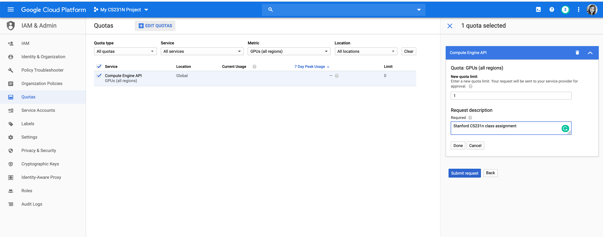
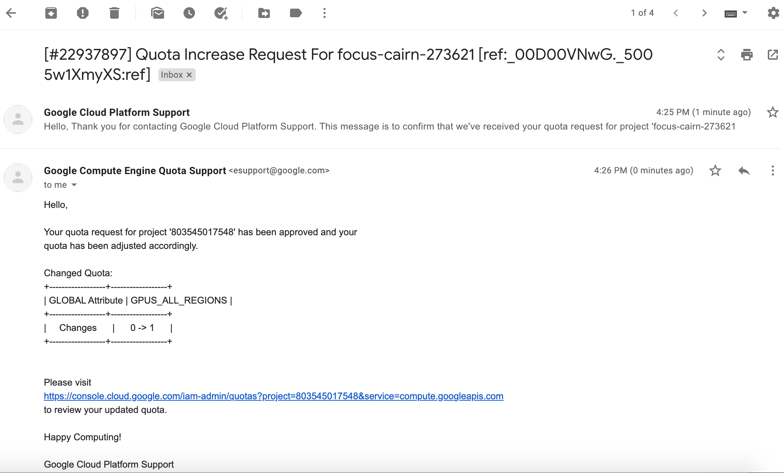
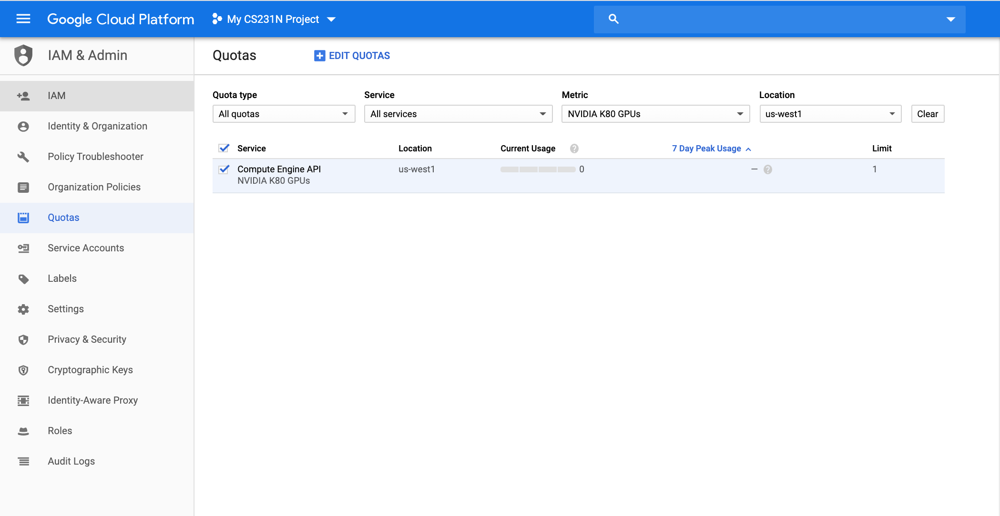

# Google Cloud Setup and Tutorial

(Last Update on April 8, 2020)

## Before We Begin ##
### BIG REMINDER: Make sure you stop your instances! ###

(We know you won't read until the very bottom once your assignment is running, so we are printing this at the top too since it is ***super important***)

Don't forget to ***stop your instance*** when you are done (by clicking on the stop button at the top of the page showing your instances), otherwise you will ***run out of credits*** and that will be very sad. :(

If you follow our instructions below correctly, you should be able to restart your instance and the downloaded software will still be available.


### Should I use GCP or Colab? ###

For your class project, we recommend setting up a GPU instance on GCP (Google Cloud Platform).

While [Colab](https://research.google.com/colaboratory/faq.html) is good for assignments, and is a helpful free tool to play around and experiment models for your project, you will find a dedicated GPU instance easier to train models:
- Colab will disconnect after 12 hours or ~30 min of idling (and you will lose your unsaved data). A GCP VM instance will not disconnect untill you stop it (or run out of credits).  
- A GCP VM instance's disk space allows you to deal with larger datasets. In Colab's case, you will have to save all your data and models to Google Drive.
- Colab does not innately support real-time collaboration.
- You can choose your GPU models and can set >1 GPUs for distributed training on GCP.


## Create and Configure Your Account ##

For the class project, we offer students **$50 GCP coupons** for each student to use Google Compute Engine for developing and testing your
implementations. 

If $50 ends up not being enough, contact course staff on Piazza. We will also send out forms for extra GCP credit request form later in the quarter.
 
This tutorial lists the necessary steps of working on the projects using Google Cloud. **We expect this tutorial to take up to an hour. Don't get intimidated by the steps, we tried to make the tutorial detailed so that you are less likely to get stuck on a particular step. Please tag all questions related to Google Cloud with google_cloud on Piazza.**

### Sign Up GCP for the first time ### 
You can skip this section if you already have a Google Cloud account set up with your personal gmail account. ** You should use your own gmail account, i.e. NOT SUID@stanford.edu because Stanford University managed account does not support creating a new project.** 

If you don't have a Google Cloud account with your Stanford email already, you should receive $300 credits from Google by default when you first sign up and **also upgrade it into a full account**. Please try to use the resources judiciously. 

1. Create Google Cloud account by going to the [Google Cloud homepage](https://cloud.google.com/?utm_source=google&utm_medium=cpc&utm_campaign=2015-q2-cloud-na-gcp-skws-freetrial-en&gclid=CP2e4PPpiNMCFU9bfgodGHsA1A "Title"). Click on the blue **Get Started for free** button. Sign into your Gmail account. Here is an illustrative example.


2. Choose **Account type** to be **Individual**. You will then fill in your name, address and credit card information.


3. Click the "Google Cloud Platform" (in red circle), and it will take you to the main project dashboard:


4. On the main project dashboard, you can change the name of your project by clicking **Go to project settings**. 


5. To add project collaborators, click **ADD PEOPLE TO THIS PROJECT**. Add their email and make their role owners. 


6. **Upgrade your account** in order to use GPUs following this [instruction](https://cloud.google.com/free/docs/gcp-free-tier#how-to-upgrade). Otherwise [Google Cloud Free Tier](https://cloud.google.com/free/docs/gcp-free-tier#how-to-upgrade) does not come with GPU support or quota.


## Claim CS231N GCP credits
NOTE: You can only receive CS231N credits with your <SUID>@stanford.edu, **BUT the GCP account should be registered with your own gmail account, because Stanford University managed account does not support creating a new project.** 

1. We will release the $50 GCP credits Google form on Piazza. After your complete the form, you will see a link to Google Cloud Education Grants page. You will need your stanford email account to receive the credits.


2. After submission, you should receive a email from GCP with a link to confirm your email address. Click the link to verify your email.


3. You will soon receive another email from GCP with a link that applys the $50 credits to your account. After that the website will jump to your [Billing](https://console.cloud.google.com/billing) page where you should see your have linked to CS231N billing account with $50 free credits. 


## Request an increase in GPU quota

Your account typically does not come with GPU quota. You have to explicitly request for it under **IAM Admin** > **Quotas**. 

**Please request the quota increase ASAP**, because they will take up between couple minutes to a week to process!  If you don't have GPU quota, you will have to create a CPU-only VM first and create another GPU VM later, explained in the next section.

**Notice there are two kinds of GPU quota you will need to adjust.** 

1. You should first change your quota of **GPU (all regions)**.  Filter the **Metric** to be **GPU (all regions)**, **Location**  to be **Global**. 


 Wait until GCP send you a second email (first email is just to notify they receive the request) that looks like this. It could take couple minutes to couple days for them to approve.
  

2. You should adjust your region-specific GPU (usually it is already 1 by default) if you want more than 1 GPU in your instance. You can filter by the **Metric** and **Location** to set the type of GPU and your region.


FAQ: 
**_Why don't I see any GPU-related quotas when I follow the instructions to filter for them?_**. 
Check that you have a default zone and region set under **Compute Engine** > **Settings** > **Region** / **Zone**. Some zones do not have GPU resources.Check [pricing and spec for GCP GPUs](https://cloud.google.com/compute/gpus-pricing) to find the availability of GPU resources. 

If you do not see any GPU-related quotas at all. Make sure you first upgrade your free tier account to full account. 

More instructions at [General quota instructions](https://cloud.google.com/compute/quotas#requesting_additional_quota) and [Step-by-step GPU-specific walk-through](https://stackoverflow.com/questions/45227064/how-to-request-gpu-quota-increase-in-google-cloud) (all answers in the link are useful)


## Google Cloud VM Image

1. Go to [this gcloud marketplace](https://console.cloud.google.com/marketplace/config/click-to-deploy-images/tensorflow). You may (or may not) be taken to a page where you have to click on "Launch", and then you should see a configuration sheet with the title "New Deep Learning VM deployment".
2. Fill in `Deployment name` field with your preferred VM name.
3. In `Machine type` field, change `2 vCPUs` to `1 vCPU`. You can always add more CPUs later if necessary.
4. In `GPUs` field, you can follow one of the two paths:
    * (a) If you have successfully requested GPU quota, you should set `Number of GPUs` to `1`. **GPU drivers and CUDA will be automatically installed _only if_ you select at least 1 GPU**. For our first project, you don't need GPUs. Since GPUs are very expensive, you can add them back when they become necessary later.
    * (b) If you don't have GPU quota yet, you must set `Number of GPUs` to `None`. WARNING: GPU drivers and CUDA will **NOT** be installed. All libraries will be CPU only. Once your GPU quota increase request is approved, you can follow path (a) to deploy a GPU-enabled image.
5. In `Frameworks` field, change `TensorFlow Enterpris 2.1 (CUDA 10.1)` to `PyTorch 1.4 + fast.ai (CUDA 10.0`. We will have instructions for you later if you want Tensorflow.
6. Check the box `Install NVIDIA GPU driver automatically on first startup?`.
7. Check the box `Enable access to JupyterLab via URL instead of SSH. (Beta)`.
8. Leave all other options as default.
9. Click the blue botton `Deploy` at the end of the page.

Your configuration sheet should look similar to below. Follow exactly the same configuration for the ones with red boxes. For configurations with orange boxes, you can adjust it based on your project need as discussed below. 


### Customize VM hardware

You can always change number of CPUs, number of GPUs, CPU memory, and GPU type after your VM has been created.

1. You must stop the instance first.
2. Go to your VM instance's details at **Compute Engine** > **VM instances** > [click on instance name]. Click "edit" on your VM's page.
3. In `Machine type` box, click `Customize`.
4. Choose your desired number of CPUs and memory. 
5. Set `Number of GPUs` to `None` if you don't need GPUs.
6. For `GPU type`, `NVIDIA Tesla K80` is typically enough. `P100` and `V100` are way more expensive, but also faster and has larger memory. Check [pricing and spec for GCP GPUs](https://cloud.google.com/compute/gpus-pricing). 
7. Scroll all the way down and click `Save` button.
8. Start your instance again.


### Configure networking

Wait until the deployment is finished. You should see a running VM with a green checkmark next to it on your [Compute Engine page](https://console.cloud.google.com/compute/).

We need to tweak a few more settings to enable remote access to Jupyter notebooks.

1. You must stop the instance first.
2. Go to your VM instance's details at **Compute Engine** > **VM instances** > [click on instance name]. Click "edit" on your VM's page.
3. Select "Allow HTTP traffic" and "Allow HTTPS traffic".
4. Scroll all the way down and click the blue button "save".
5. Go to [Firewall config page](https://console.cloud.google.com/networking/firewalls).
6. Click "CREATE FIREWALL RULE"
7. Give it an arbitrary name, such as `cs231n`.
8. In `Targets` field, select `All instances in the network`.
9. In `Source IP ranges`, enter `0.0.0.0/0`.
10. In `Protocols and ports` field, select "Specified protocols and ports". Then check `tcp` and enter `7000-9000`.
11. Click the blue button `Create`.
12. Restart your instance on the Compute Engine page.

Your configuration sheets should look similar to below:


Firewall Rules:


## Access your newly created VM

Now that you have created your virtual GCE, you want to be able to connect to it from your computer. The rest of this tutorial goes over how to do that using the command line. 

### Install gcloud command-line tools
To access [gcloud commands](https://cloud.google.com/sdk/gcloud/reference) in your local terminal, install [Google Cloud SDK](https://cloud.google.com/sdk/docs) that is appropriate for your platform and follow their instructions. 

If `gcloud` command is not in your system path after installation, you can also reference it by its full path `/<DIRECTORY-WHERE-GOOGLE-CLOUD-IS-INSTALLED>/bin/gcloud`. See [this page](https://cloud.google.com/compute/docs/instances/connecting-to-instance "Title") for more detailed instructions.

To ssh into your VM, go to your VM instance details page by clicking on its name. Start the VM instance first. Once it has a green check mark on, click on the drop-down arrow and select `View gcloud command` instead to retrieve the terminal command. It should look like

```bash
gcloud compute --project "<YOUR_PROJECT_ID>" ssh --zone "us-west1-b" "<YOUR_VM_NAME>"
```


## First-time Setup Script

After you SSH into the VM for the first time, you need to run a few commands in your home directory. You will be asked to set up a password for your Jupyter notebook.
```bash
git clone https://github.com/cs231n/gcloud.git
cd gcloud/
chmod +x ./setup.sh
./setup.sh
```

### Verification

If you have GPU enabled, you should be able to:

* run `nvidia-smi` and see the list of attached GPUs and their usage statistics. Run `watch nvidia-smi` to monitor your GPU usage in real time.
* inside the `gcloud/` folder, run `python verify_gpu.py`. If your GPU is attached and CUDA is correctly installed, you shouldn't see any error.
* If you want to use Tensorflow 2.0, run `python test_tf.py`. The script will show you the installed Tensorflow version (2.0.0-alpha) and then run a sample MNIST training. You should see around 97% accuracy at the end.  

## Using Jupyter Notebook with Google Compute Engine ##
You can also use Jupyter Notebook to experiment in your projects. Below, we discuss how to run Jupyter Notebook from your GCE instance and connect to it with your local browser.

### Getting a Static IP Address ###
Change the External IP address of your Google Cloud Engine instance to be static (see screenshot below).


To Do this, click on the 3 line icon next to the **Google Cloud Platform** button on the top left corner of your screen, go to **VPC network** > **External IP addresses** (see screenshot below).


To have a static IP address, change **Type** from **Ephemeral** to **Static**. Enter your prefered name for your static IP, ours is `cs231n-ip` (see screenshot below). And click on Reserve. 

**NOTE:** At the end of CS 231N when you don't need your instance anymore, release the static IP address because Google charges a small fee for unused static IPs (according to [this page](https://jeffdelaney.me/blog/running-jupyter-notebook-google-cloud-platform/)).


Take note of your Static IP address (circled on the screenshot below). We use 35.185.240.182 for this tutorial.


## Transferring Files From Your Instance To Your Computer ##

For instance, to transfer `file.zip` from GCE instance to your local laptop. There is an [easy command](https://cloud.google.com/sdk/gcloud/reference/compute/scp) for this purpose:

```
gcloud compute scp <user>@<instance-name>:/path/to/file.zip /local/path
```

For example, to download files from our instance to the current folder:

```
gcloud compute scp tonystark@cs231:/home/shared/file.zip .
```

The transfer works in both directions. To upload a file to your instance:

```
gcloud compute scp /my/local/file tonystark@cs231:/home/shared/
```

If you would like to transfer an entire folder, you will need to add a resursive flag: 
```
gcloud compute scp --resursive /my/local/folder tonystark@cs231:/home/shared/
```


### Remote Server Development ###


Use [Tmux](https://linuxize.com/post/getting-started-with-tmux/) to keep the training sessions running when you close your laptop. Also, if your collaborators log into the same account on the VM instance, they will see the same tmux session screen in real time. 

You can develop your code on remote server directly if you are comfortable with vim or emac.

Alternatively, you can develop locally on your favorite editor, push to your branch on Github, and pull on remote server to run.
(git commit frequently is also one of [good Github practices](https://www.datree.io/resources/github-best-practices))

 
### Launching and connecting to Jupyter Notebook ###

After you ssh into your VM using the prior instructions, run Jupyter notebook from the folder with your assignment files.

```
jupyter notebook
```

The default port is `8888`, specified in `~/.jupyter/jupyter_notebook_config.py`.

You can connect to your Jupyter session from your personal laptop. Open any browser and visit `35.185.240.182:8888`. The login password is the one you set with the setup script above.


## BIG REMINDER: Make sure you stop your instances! ##

Don't forget to stop your instance when you are done (by clicking on the stop button at the top of the page showing your instances). You can restart your instance and the downloaded software will still be available.

We have seen students who left their instances running for many days and ran out of credits. You will be charged per hour when your instance is running. This includes code development time. We encourage you to read up on Google Cloud, regularly keep track of your credits and not solely rely on our tutorials.
